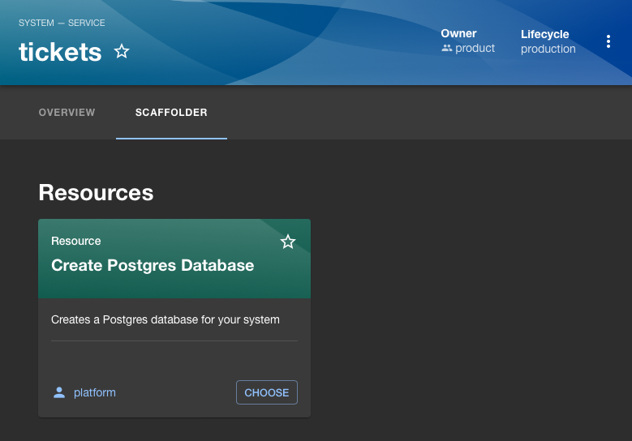
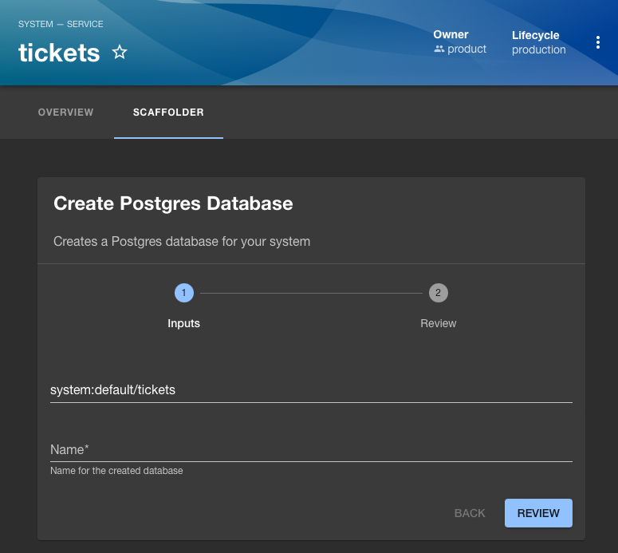

# @seatgeek/backstage-plugin-entity-scaffolder-content

This plugin offers the ability to run Software Templates from within an entity's EntityPage. Templates, once selected, can be autopopulated with data from the Entity. For example, if I am on the EntityPage for `system:default/tickets` and I select a template for creating a new Postgres database, I can autopopulate that template's `system:` field to `system:default/tickets`.

[](https://www.npmjs.com/package/@seatgeek/backstage-plugin-entity-scaffolder-content)





This plugin addresses https://github.com/backstage/backstage/issues/16053 and builds on top of [@frontside/backstage-plugin-scaffolder-workflow](https://github.com/thefrontside/playhouse/tree/main/plugins/scaffolder-frontend-workflow).

## Installation

### Install the package

Install the `@seatgeek/backstage-plugin-entity-scaffolder-content` package in your frontend app package:

```shell
# From your Backstage root directory
yarn add --cwd packages/app @seatgeek/backstage-plugin-entity-scaffolder-content
```

### Add the plugin to your `EntityPage`

```tsx
import { EntityScaffolderContent } from '@seatgeek/backstage-plugin-entity-scaffolder-content';

const systemPage = (
  <EntityLayout>
    {/** ... */}
    <EntityLayout.Route path="/scaffolder" title="Scaffolder">
      <EntityScaffolderContent
        templateGroupFilters={[
          // We show all resource templates that have the label `forEntity:system``
          // on our systen EntityPage
          {
            title: 'Resources',
            filter: (_, template) =>
              template.metadata?.labels?.forEntity === 'system' &&
              template.spec.type === 'Resource',
          },
          // If our system defines its language as python, we show all templates
          // that are intended to be applied to pythom systems.
          {
            title: 'Python',
            filter: (entity, template) =>
              template.metadata?.labels?.forEntity === 'system' &&
              entity.metadata?.labels?.language === 'python' &&
              template.metadata?.labels?.language === 'python',
          },
        ]}
        buildInitialState={entity => ({ system: stringifyEntityRef(entity) })}
      />
    </EntityLayout.Route>
  </EntityLayout>
);
```
